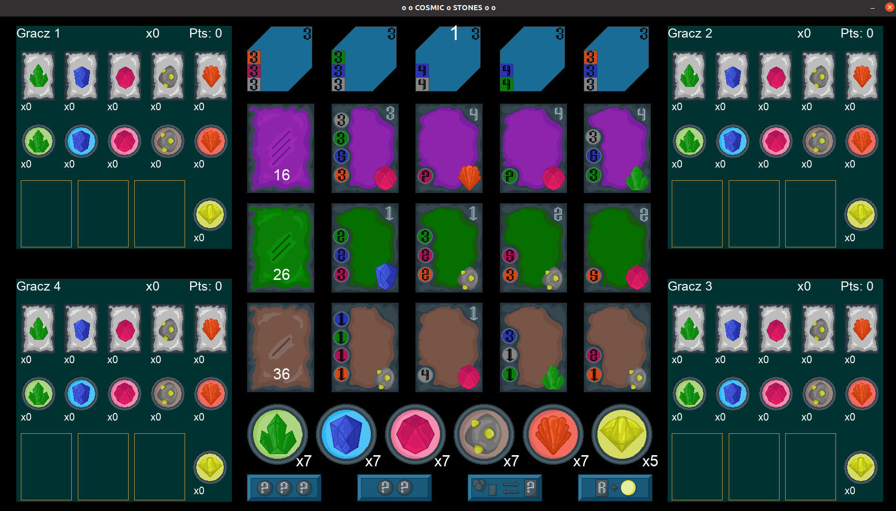
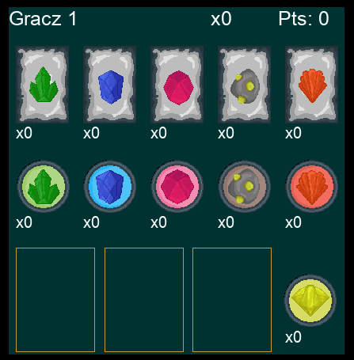
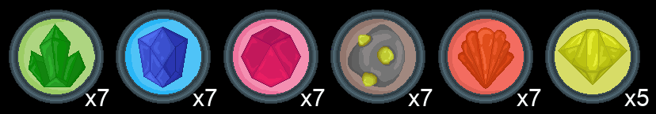
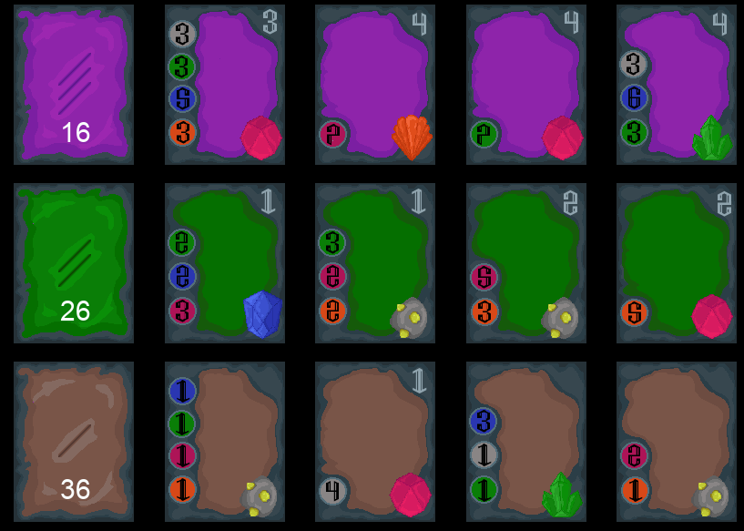
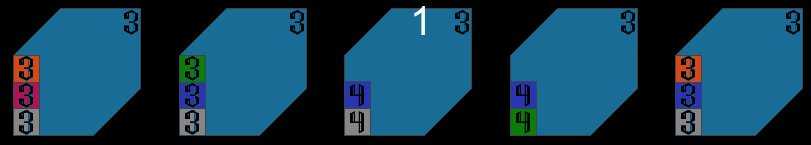

#  COSMIC STONES
### Game based on the board game "Splendor"

---

## General info

Cosmic Stones is a game based on the board game "Splendor". The game was written based on the rules of the board game 
with little difference. I also added my own 2D graphics. The logic of the game works fine, but some things will change 
and I will finish the graphics.

After cloning the project on your computer and entering the project folder in the terminal, please enter the command:

    $ pip install -r requirements.txt 

to install all the necessary libraries for the script to run properly.

## Technologies
- Python 3.8
- Pygame 2.0.1

---
## Description of the application with examples
After starting the game, selecting the number of players and entering the names, the main game screen will appear.

    pic.1 Main view

The main screen is divided into five areas, they are:
- player area
- marker area
- button area
- development cards area
- planet card area

The goal of the game is to earn as many prestige points as possible. The game ends when any of the players reaches the 
number of points equal to 15. Prestige points are earned by bonus points on cards or by visiting planets.

In the game, each player may perform 4 actions during his turn:
- you can take three different markers
- you can take two markers of one color if there are at least 4 of them in the stack
- you can reserve a card and take the yellow marker
- buy 1 face-up card from the table or 1 reserved card from your hand

Depending on the number of players selected (from 2 to 4), the game automatically selects the number of markers 
and planet cards.

### Player area

    pic.2 Player board

On the player board are:
- player name
- points
- number of planet cards
- collected development cards
- collected cosmic stones markers
- three area with reserved cards

### Markers area

    pic.3 Markers area

On the marker areas we can see all markers with their quantity. 
Here we can choose which marker we want to take in our turn.

### Buttons area

    pic.4 Buttons area

Here we can see all allowed actions in the gam: 
- take three different markers
- take two markers of one color if there are at least 4 of them in the stack
- buy 1 face-up card from the table or 1 reserved card from your hand
- reserve a card and take the yellow marker

During the game, you must choose one of the actions. For example, click the select three markers button and then select 
three markers from the markers area.

### Development cards area

    pic.5 Development cards area

On this board we can buy card if you afford it or reserve it and take yellow marker (yellow marker is a joker and it 
can be use like any other markers).

If you have collected the appropriate number of markers or have development cards, you can buy a new development card. 
The price of the card is the amount of comic stones indicated on the card on the left. Prestige points are in the top 
right corner and a space stone is indicated in the bottom right corner.

### Planet card area

    pic.6 Planet cards

Planet cards are shown in this area. After each turn, the game checks if you can visit the planet from the cards. 
If you have enough development cards of the color shown on the planet card, you receive that card at the end of your 
turn. Score three prestige points for each of these cards.

The number one in the center of this area indicates the number of the player whose turn is

### End of the game

After finishing the game, press enter to start a new game with the same players or press backspace to enter 
a new number of players